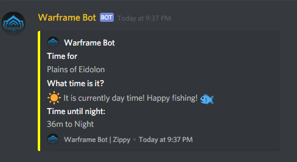
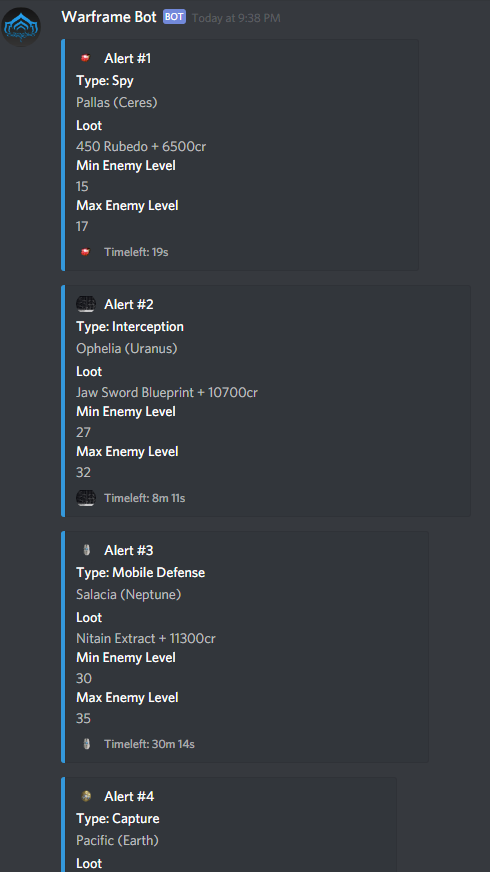

# Warframe Discord Bot
> A discord bot that provides real time information about warframe.

[Bot invite link](https://discordapp.com/oauth2/authorize?client_id=432276575044632586&scope=bot)

[](https://forthebadge.com)
[](https://forthebadge.com)






## Commands

+help

```
You will receive a DM of all current commands
```

+time

```
Shows the current time for Plains of Eidolon and a countdown to when it turns night / day.
```

+alert

```
Shows all the current alerts, locations, gamemodes, loot rewards, enemy levels, and time left.
```

+void

```
Shows the current location and time of the void trader.
```

+code

```
Links to this repo.
```

+farm

```
Links to a helpful video about farming in warframe.
```

More soon

```
More commands are on the way!
```
## Want to help?

Feel free to contribute with anything, I'm a newbie at this and appreciate any help!

## Want to run it yourself?

Download app.js and install the npm modules discord.js and snekfetch
You will also have to make a config.json file in the same folder as app.js, inside you'll need to place this in and replace the token with your bot token.

```
{ "token"  : "MTg-this-IzNzU3OTA5NjA-is.not-DCeFB-a.real-r4DQlO-t0ken-qerT0",
  "prefix" : "+"
}
```

## API

We use the warframestat.us API found [here](https://api.warframestat.us/)

